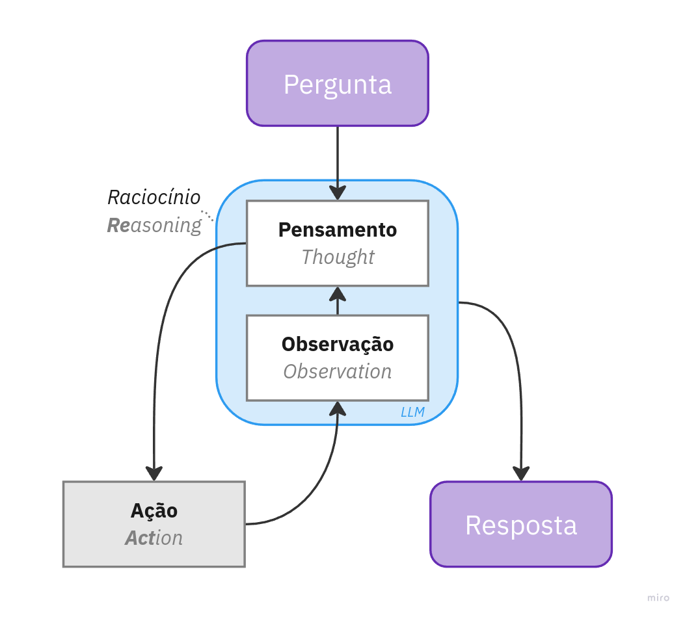

# Implementando o padrão ReAct em Agentes LLM com Python

ReAct é uma abordagem para o desenvolvimento de agentes com LLMs (Large Language Models) que combina raciocínio e ação para realizar tarefas de maneira eficiente e adaptativa. O nome "ReAct" deriva das palavras "Reasoning" (Raciocínio) e "Acting" (Ação), pois os agentes com essa arquitetura são projetados para não apenas gerar respostas baseadas em padrões de linguagem, mas também refletir sobre o que estão fazendo e tomar ações com base nesse raciocínio.

Fonte: [ReAct: Synergizing Reasoning and Acting in Language Models](https://arxiv.org/abs/2210.03629)



# Instruções para Utilização do Script

## Requisitos

- Python 3.8 ou superior
- Uma chave de API da OpenAI (caso não possua, [crie sua chave aqui](https://platform.openai.com/account/api-keys))

## Passo a Passo para Configuração e Execução

### 1. Criar um Ambiente Virtual

Para isolar o ambiente e as dependências do projeto, crie um ambiente virtual, por exemplo utilizando `virtualenv`. 

### 2. Instalar Dependências

Com o ambiente virtual ativado, instale as dependências listadas no arquivo requirements.txt:

```bash
$ pip install -r requirements.txt
```

### 3. Configurar a Chave de API da OpenAI
Este projeto utiliza a API da OpenAI. Para isso, você precisará de uma chave de API. Caso ainda não tenha uma, crie uma [aqui](https://platform.openai.com/account/api-keys).

### 4. *Notebook* mostrando o passo a passo

Caso queira seguir um exemplo mais detalhado, um notebook de exemplo está disponível na pasta 'notebooks', que mostra um passo a passo da execução e utilização das funcionalidades do projeto.

### 5. Executar o Agente LLM

O script principal do projeto está localizado na pasta 'app' e pode ser executado da seguinte maneira:

```bash
$ python ./app/agente-react.py "<sua_pergunta>"
```
Por exemplo:
```
$ python ./app/agente-react.py "Quero comprar um teclado e dois monitores. Quanto vou gastar?"
```

-----


